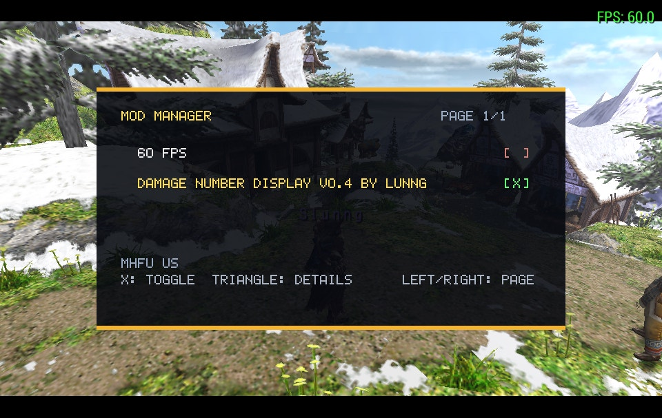
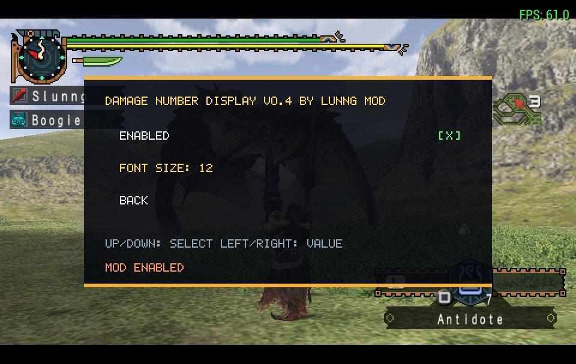

# PSP Lua Mod Manager

A PRX plugin that runs Lua inside a PSP games. It provides Lua APIs for input, memory,
loading mod files.

Game-specific addresses and behavior belong in individual mods under `mods/`.
The overlay itself does not contain a game list.




## Build

Install [PSPSDK](https://pspdev.github.io/), then run:

```sh
make deps
make
```

## Mods

Place each mod in its own Memory Stick directory with a `mod.lua` entry point:

```text
ms0:/mods/example_mod/mod.lua
```

The mod manager scans `ms0:/mods` automatically. Adding or removing a mod does
not require editing `main.lua`. A mod may keep its binaries and hook definitions
in subdirectories such as `bins/` and `hooks/`.

Enabled mods are stored separately for each game ID in
`ms0:/mods/.psp_lua_mod_manager_<GAME_ID>.cfg` and are restored when the manager starts.

## Install on PPSSPP

Copy these files to:

```text
PSP/PLUGINS/psp_lua_mod_manager/plugin.ini
PSP/PLUGINS/psp_lua_mod_manager/psp_lua_mod_manager_core.prx
PSP/PLUGINS/psp_lua_mod_manager/main.lua
```

The supplied `plugin.ini` uses `ALL = true`, so PPSSPP may load the overlay for
any game. PPSSPP loads the user-mode core directly; do not copy the bootstrap
PRX into `PSP/PLUGINS`.

## Install on a real PSP with CFW

Copy these files to:

```text
ms0:/seplugins/psp_lua_mod_manager/psp_lua_mod_manager.prx
ms0:/seplugins/psp_lua_mod_manager/psp_lua_mod_manager_core.prx
ms0:/seplugins/psp_lua_mod_manager/main.lua
```

Register only the bootstrap in the CFW GAME plugin file:

```text
ms0:/seplugins/psp_lua_mod_manager/psp_lua_mod_manager.prx 1
```

### Why the bootstrap is necessary

A real PSP loads GAME plugins while the game itself is starting. Loading the
full Lua runtime at that moment consumes enough memory to prevent larger games
from starting or can make them crash. The bootstrap is a very small kernel
plugin that stays idle and uses little memory. After the game reaches a stable
scene, press L+R+SELECT once; the bootstrap then loads the larger user-mode core
and unloads itself.

If loading fails, diagnostics are appended to:

```text
ms0:/seplugins/psp_lua_mod_manager/load_error.txt
```

START+SELECT reloads `main.lua` after the core is running.

## Controls

- L+R+SELECT: load the core on a real PSP, then open or close the panel.
- UP/DOWN: move through menu items.
- LEFT/RIGHT: move one page at a time.
- X: enable or disable the selected mod.
- TRIANGLE: open the selected mod's details and settings.
- START+SELECT: reload `main.lua`.

## Lua API

- `overlay.rect(x, y, width, height, r, g, b, a)`
- `overlay.text(text, x, y, scale, r, g, b, a)`
- `memory.read8/16/32(address)`
- `memory.write8/16/32(address, value)`
- `memory.dump(path, address, size)`
- `mods.list()`
- `mods.load_state(game_id)` and `mods.save_state(game_id, data)`
- `mods.load_bin(path, address)`
- `mods.load_lua(path)`
- `mods.hook32(owner, address, opcode[, original])`
- `mods.disable(owner)` and `mods.is_active(owner)`
- `system.game_id()`, `system.free_memory()`, and `system.time()`
- `input.down(button)` and `input.pressed(button)`
- `draw()` is called once per frame.
